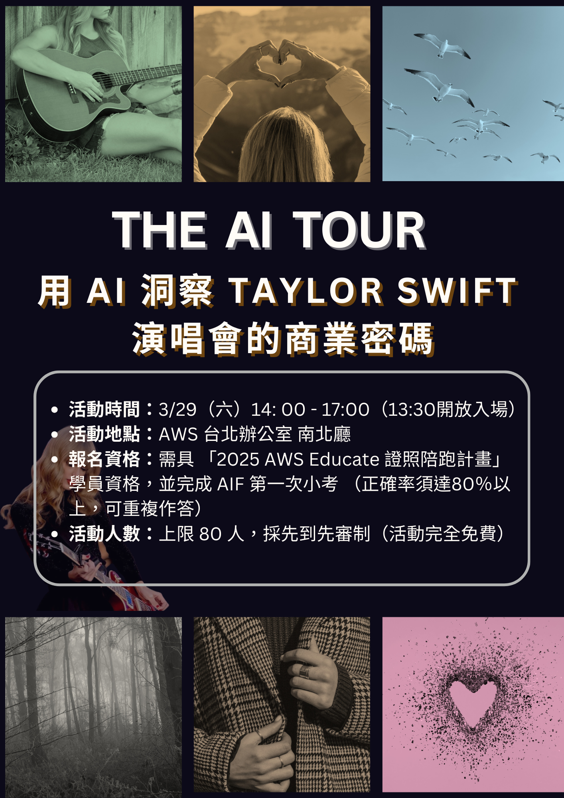

  

 
<h1 align="center">The AI Tour：用 AI 洞察 Taylor Swift 演唱會的商業密碼</h1>

  
  

歡迎來到 AWS Educate 【用 AI 洞察 Taylor Swift 演唱會的商業密碼】 工作坊！在本工作坊將學習使用 Bedrock, Amplify，從模型選擇、Bedrock Flow到前後端部署，親手打造一個能夠分析演唱會資料的 AI Agent，能提供最完善的商業圖表和建議。
